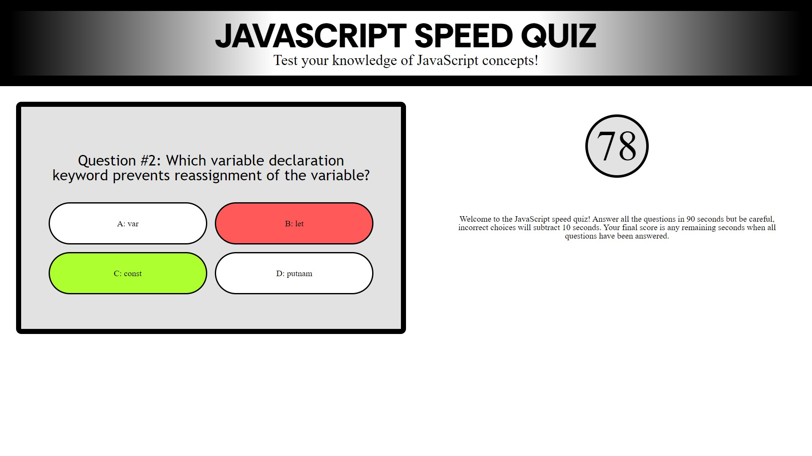

# JavaScript Speed Quiz

https://chairsitter.github.io/JavascriptQuizGame/

## Description

This web app is an interactive quiz about 10 JavaScript concepts, with emphasis on accuracy and speed. High scores are saved in local storage and displayed.

- This project is a fun review game for JavaScript students. It is made with the complete beginner in mind, as the questions maintain a set order, allowing anybody to play until they memorize the information and get all the answers right. 
- I built this project to practice concepts involved in making an interactive game and using object to store and display multiple points of related data.
- This quiz is a fun study guide for beginner JavaScript students or anyone interested enough to learn a few trivia facts and concepts
- While building this project, I learned about the use of local storage to hold a high score list, and related concepts of turning information from an array of object to a string and back again. I practiced breaking the logic of a game into modular functions that call one another in order. I continued to learn the ins and outs of combining HTML, CSS, and JavaScript and the use of display and visiblity changes to hide and display information. 

## Usage

The game is straightforward to use and at screen sizes larger than mobile phones it displays an introductory explanation paragraph. Try to answer all the questions in 90 seconds. Incorrect responses will subtract 10 seconds. The number of seconds left on the clock when all 10 questions are answered becomes your score. Enter your initials or name and see where you rank on the local leaderboard, then try again for a higher score.

## Credits

Reset CSS file from MeyerWeb:
http://meyerweb.com/eric/tools/css/reset/ 
v2.0 | 20110126
License: none (public domain)

All other files were created by myself. 

## License

This project uses a MIT license, please refer to this license information in the repository. 

